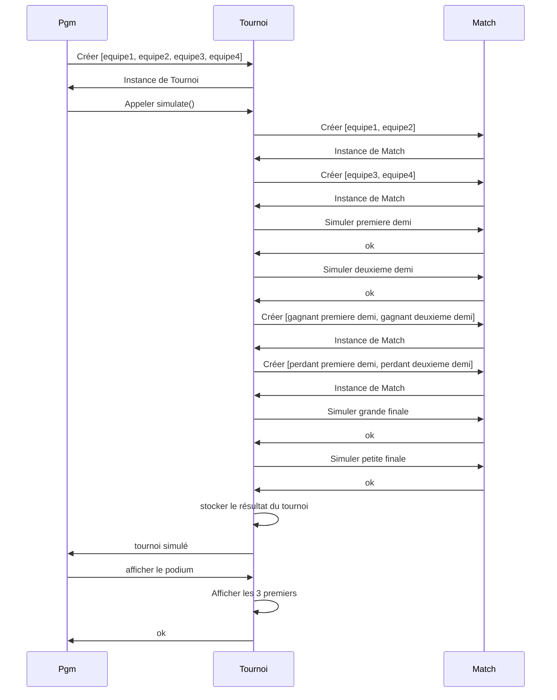
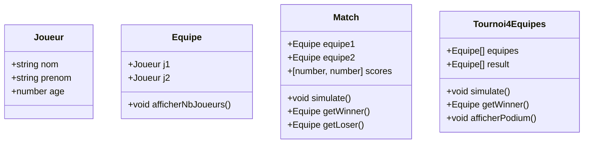

# Correction de l'exercice sur le basket

## Diagrammes

### Diagramme de séquence

Après avoir initialisé les 8 joueurs et 4 équipes ...



### Diagramme de classe



## Code

```typescript
class Joueur {

    public nom: string
    public prenom: string
    public age: number

    constructor(
        nom: string,
        prenom: string,
        age: number,
    ) {
        this.nom = nom
        this.prenom = prenom
        this.age = age
    }
}
```

```typescript
class Equipe {

    public j1: Joueur
    public j2: Joueur

    constructor(
        j1: Joueur,
        j2: Joueur,
    ) {
        this.j1 = j1
        this.j2 = j2
    }

    public afficherNbJoueurs(): void {
        console.log('le nombre de joueurs de mon équipe est de 2')
    }

}
```

```typescript
class Match {

    public equipe1: Equipe
    public equipe2: Equipe
    public scores: [number, number]

    constructor(
        equipe1: Equipe,
        equipe2: Equipe,
        scores: [number, number] = [0, 0]
    ) {
        this.equipe1 = equipe1
        this.equipe2 = equipe2
        this.scores = scores
    }

    public simulate() {
        while (this.scores[0] < 20 && this.scores[1] < 20) {
            const equipeIndex = Math.floor(Math.random() * 2)
            this.scores[equipeIndex] += Math.floor(Math.random() * 3) + 1
        }
    }

    public getWinner(): Equipe {
        if (this.scores[0] > this.scores[1]) {
            return this.equipe1
        } else {
            return this.equipe2
        }
    }

    public getLoser(): Equipe {
        if (this.scores[0] < this.scores[1]) {
            return this.equipe1
        } else {
            return this.equipe2
        }
    }

}
```

```typescript
class Tournoi4Equipes {
    public equipes: Equipe[]
    public result: Equipe[]

    constructor(
        equipes: Equipe[],
        result: Equipe[] = []
    ) {
        this.equipes = equipes
        this.result = result
    }

    simulate() {
        const premierDemi = new Match(this.equipes[0], this.equipes[1])
        const deuxiemeDemi = new Match(this.equipes[2], this.equipes[3])
        premierDemi.simulate()
        deuxiemeDemi.simulate()
        const grandeFinale = new Match(premierDemi.getWinner(), deuxiemeDemi.getWinner())
        const petiteFinale = new Match(premierDemi.getLoser(), deuxiemeDemi.getLoser())
        grandeFinale.simulate()
        petiteFinale.simulate()
        this.result = [grandeFinale.getWinner(), grandeFinale.getLoser(), petiteFinale.getWinner(), petiteFinale.getLoser()]
    }

    public getWinner(): Equipe {
        return this.result[0]
    }

    public afficherPodium(): void {
        this.result.slice(0, 3).forEach((equipe, index) => {
            console.log(`${index + 1} - ${equipe.j1.prenom} ${equipe.j1.nom} et ${equipe.j2.prenom} ${equipe.j2.nom}`)
        })
    }
}
```

```typescript
const j1 = new Joueur('j1', 'j1', 20)
const j2 = new Joueur('j2', 'j2', 20)
const j3 = new Joueur('j3', 'j3', 20)
const j4 = new Joueur('j4', 'j4', 20)
const j5 = new Joueur('j5', 'j5', 20)
const j6 = new Joueur('j6', 'j6', 20)
const j7 = new Joueur('j7', 'j7', 20)
const j8 = new Joueur('j8', 'j8', 20)

const equipe1 = new Equipe(j1, j2)
const equipe2 = new Equipe(j3, j4)
const equipe3 = new Equipe(j5, j6)
const equipe4 = new Equipe(j7, j8)

const tournoi = new Tournoi4Equipes([equipe1, equipe2, equipe3, equipe4])
tournoi.simulate()
tournoi.afficherPodium()
```