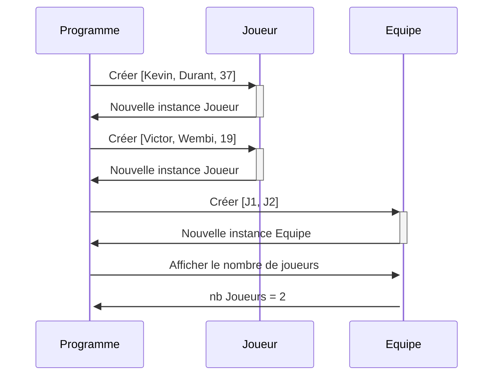
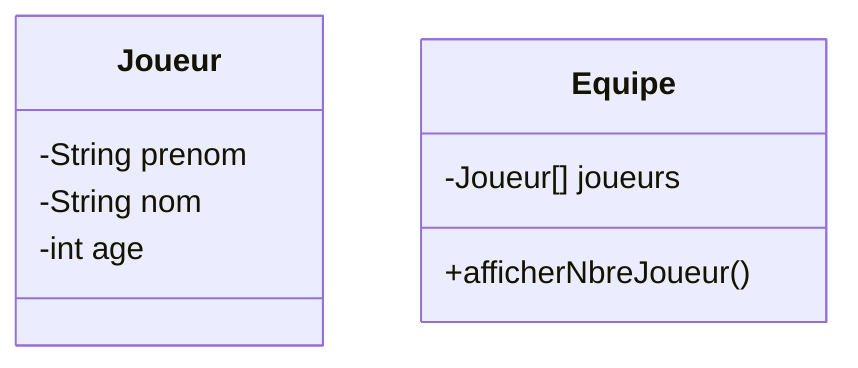
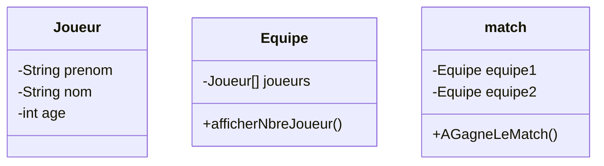
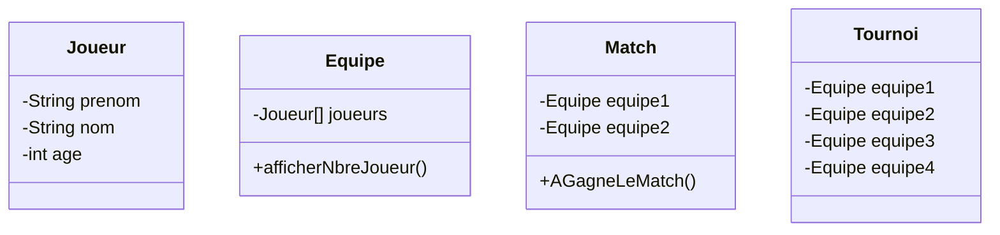

# TP - Basket

## Consgines

Créer un diagramme de classe et le code associé à ce diagramme de séquence



## Solution proposée



```ts
export class Joueur {
    private _prenom : string
    private _nom : string
    private _age : number

    constructor(monPrenom: string, monNom : string, monAge :number) {
        this._prenom = monPrenom;
        this._nom = monNom;
        this._age = monAge;
    }

    
    public get prenom() : string {
        return this._prenom;
    }

    
    public set prenom(monPrenom : string) {
        this._prenom = monPrenom;
    }
    
    public get nom () : string {
        return this._nom;
    }

    
    public set nom(monNom : string) {
        this._nom = monNom;
    }
    public get age() : number {
        return this._age;
    }

    
    public set age(monAge : number) {
        this._age = monAge;
    }
}

import { Joueur } from "./Joueur"

export class Equipe {
    private _joueurs : Joueur[]

    constructor(mesJoueurs : Joueur[]) {
        this._joueurs = mesJoueurs  ;
    }

    
    public get joueurs() : Joueur[] {
        return this._joueurs;
    }
    
    
    public set joueurs(mesJoueurs : Joueur[]) {
        this._joueurs = mesJoueurs;
    }
    

    /**
     * afficherNbreJoueur
     */
    public afficherNbreJoueur() : number {
       return this._joueurs.length; 
    }
}
```

## Partie 2 - créer

1 - Créer un match de basket entre deux équipes de deux joueurs chacune


```ts
import { Equipe } from "./Equipe";

export class Match {
    private _equipe1 : Equipe
    private _equipe2 : Equipe
    private _scoreDuMatch : number[]

    constructor(monEquipe1:Equipe, monEquipe2:Equipe, monScoreDuMatch:number[]) {
        this._equipe1 = monEquipe1;
        this._equipe2 = monEquipe2;
        this._scoreDuMatch = monScoreDuMatch;
    }

    
    public get equipe1() : Equipe {
        return this._equipe1
    }    
    public set equipe1(monEquipe1 : Equipe) {
        this._equipe1 = monEquipe1;
    }

    public get equipe2() : Equipe {
        return this._equipe2
    }    
    public set equipe2(monEquipe2 : Equipe) {
        this._equipe2 = monEquipe2;
    }

    
    public get scoreDuMatch() : number[] {
        return this._scoreDuMatch;
    }
    
    public set scoreDuMatch(monScore : number[]) {
        this._scoreDuMatch = monScore;
    }
    
    /**
     * AGagneLeMatch
     */
    public AGagneLeMatch(monScore : number[]) : Equipe {
        if (monScore[1]>monScore[0]) {
            return this._equipe2; 
        }
        else{
            return this._equipe1;
        }
        
    }
    
}
```

2 - Créer un tournoi avec 4 équipes
